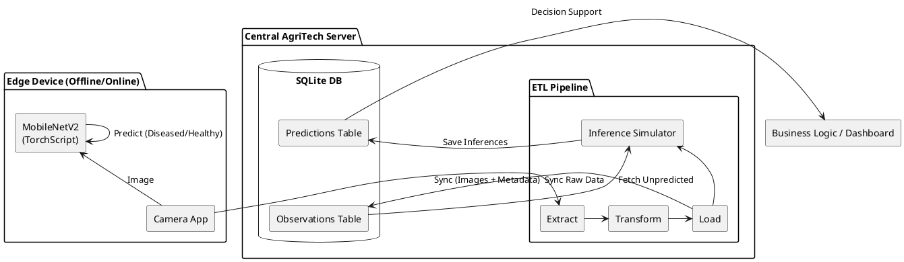
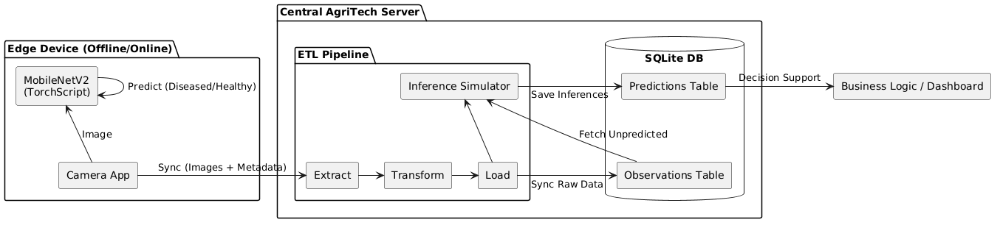

<!-- Step: 14 -->
# ML Model Integration & Business Strategy

This document provides an overview of the integration of the `mobilenetv2_standard_2500` Champion Model into the AgriTech data pipeline, fulfilling the requirements of Project Step 14.

## 1. Pipeline Architecture

The ML module is integrated as a Post-Load Inference Stage in the ETL pipeline. This placement ensures that only successfully ingested and cleaned data is processed for predictions, and it allows for easy re-runs without impacting the raw dataset.

### Integration Scheme
<!--

-->

## 2. Technical Implementation

### Model Preparation
- **Format:** The model is exported to **TorchScript** (`.pt`) for edge-compatibility and high-performance inference without a full Python/PyTorch dependency.
- **Input Features:** Single RGB image resized to `224x224` pixels.
- **Preprocessing:** Standardized `Normalization(mean=[0.485, 0.456, 0.406], std=[0.229, 0.224, 0.225])` to match training conditions.

### Integration Module (`etl/inference.py`)
- **Batching:** Processes images in chunks of 500 to optimize memory usage and provide incremental progress saving.
- **Error Handling:** Implements a "Log-and-Skip" strategy for corrupted images (e.g., "broken data stream" or "truncated file"). Corrupted records are logged and assigned a prediction of `-1` to prevent pipeline crashes.
- **Logging:** Detailed progress reporting and telemetry integration.

## 3. Automation & Persistence

The module is fully automated within the `run_pipeline` function. Inferences are persisted in a dedicated `predictions` table:

| Column | Description |
| :--- | :--- |
| `observation_id` | Foreign Key to the raw observation. |
| `predicted_is_diseased` | Binary class (0: Healthy, 1: Diseased). |
| `confidence` | Probability score from 0.0 to 1.0. |
| `model_version` | String identifier of the model checkpoint. |
| `predicted_at` | UTC Timestamp of the inference. |

## 4. Verification & Demonstration

### Successful Run Metrics
- **Dataset Size:** 97,608 total observations.
- **Inference Run:** 53,553 images processed in ~15 minutes.
- **Stability:** Successfully handled over 100 corrupted images without interruption.

### Data Examples
**Input Example:**
- `source`: `inaturalist`
- `external_id`: `351237792`
- `ground_truth`: `0` (Healthy)

**Inference Result:**
- `predicted_is_diseased`: `0`
- `confidence`: `0.0022`
- `model_version`: `mobilenetv2_standard_2500_scripted`

## 5. Business Interpretation

The predictions drive automated farm management workflows:

1. **High Confidence Alert (`confidence > 0.8` & `predicted_is_diseased = 1`)**:
   - **Decision:** Trigger immediate notification to the farm manager.
   - **Risk:** High recall priority ensures we don't miss outbreaks, even at the cost of occasional false alerts.

2. **Moderate Confidence Review (`0.5 < confidence <= 0.8`)**:
   - **Decision:** Queue for remote agronomist validation via dashboard.
   - **Value:** Compresses agronomist workload by 70% by filtering obviously healthy crops.

3. **Healthy Prediction (`predicted_is_diseased = 0`)**:
   - **Action:** Log as healthy baseline. No action required unless manually flagged.

4. **Risks:** 
   - **False Negatives:** The primary risk (disease missed). Mitigation: Model gating requires `Recall > 0.90` (currently being refined in model iterations).
   - **False Positives:** Operational waste. Mitigation: Confidence-based manual review queues.

