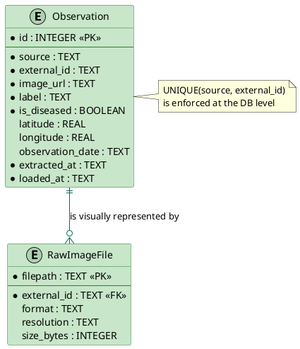
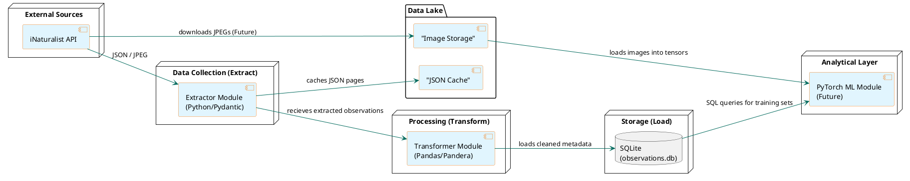
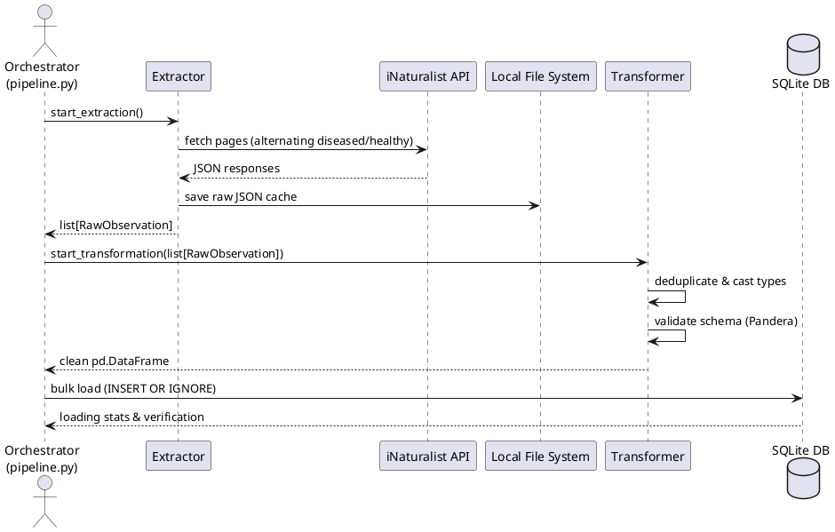
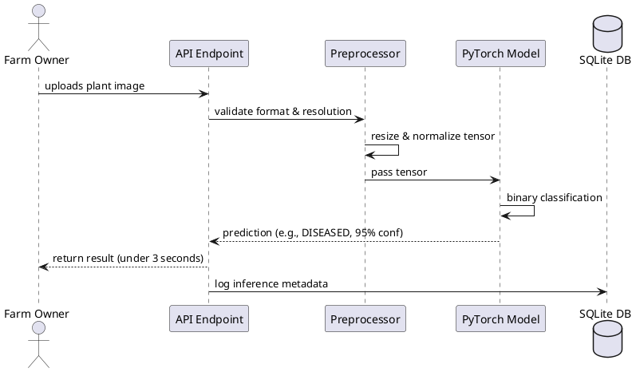

# AgriTech Plant Disease Detection — Data Architecture

## 1. Role of Data Architecture in the Project
This data architecture supports the core business goal of the AgriTech project to compress crop disease response time from days to seconds. By efficiently collecting, validating, and storing field observations, the architecture enables the training and eventual deployment of a binary classification model (Healthy vs. Diseased) with a target F1-score of >= 90% and an inference time of <= 3 seconds.

The architecture is designed to handle real-world, noisy data and guarantees that the machine learning pipeline is fed with balanced, correctly formatted, and easily accessible inputs.

## 2. Data Sources and Ingestion Flows
The primary source of data is the **iNaturalist API**, which provides access to millions of community-contributed plant photographs taken in realistic field conditions.

*   **Name:** iNaturalist API (v1)
*   **Type:** Open Web REST API
*   **Format:** JSON (metadata), JPEG/PNG (images)
*   **Update Frequency:** Continuous (new observations are added daily)
*   **Key Attributes:** `id`, `image_url`, `taxon.name`, `location`, `observed_on`, `quality_grade`
*   **Data Quality Challenges & Handling:**
    *   **Sparse annotations:** Handled by a balanced fetching strategy using specific API query parameters (`term_id=9`, `term_value_id=11` for diseased, and without it for healthy).
    *   **Inconsistent coordinates:** Handled via filtering out-of-bounds latitude/longitude during transformation.
    *   **Label noise:** Observations are restricted to `research` grade where possible to maximize reliability.

## 3. Choice of Data Storage Schema
The project employs a hybrid storage model suitable for an efficient ETL process and analytical ML training:

*   **Relational DB (SQLite):** Acts as the primary lightweight Data Warehouse for structured metadata. SQLite was chosen because it perfectly fits the scope of a 16-week project: it supports ACID transactions, idempotent bulk loads, schema enforcement, and requires no separate server management.
*   **Local File System (Data Lake):** Acts as a raw cache for JSON responses (`data/raw/inaturalist/`) and a storage layer for the actual JPEG images. This prevents redundant API network calls and avoids storing large binary blobs in the relational database.

This constitutes a localized **Lakehouse** approach: raw, unstructured data sits on disk, while structured, queryable metadata sits in the SQLite database.

## 4. Entity-Relationship Model
The following ER diagram maps the structured metadata stored in our SQLite database, alongside the physical image files stored on disk.

**Figure 1:** ER Diagram of Observation metadata and physical RawImageFiles.
*Actual Image is in docs/images/data_architecture_observations_ER.png*

## 5. Integration Design
The architecture utilizes a custom Python-based **ETL (Extract, Transform, Load)** pipeline.

*   **Approach:** ETL
*   **Extraction:** Executed by `etl/extract.py` using Pydantic for configuration validation. Fetches data via the iNaturalist API, **returns a list of observation objects to the orchestrator**, and optionally stores a page-level JSON cache to disk for persistence.
*   **Transformation:** Executed by `etl/transform.py`. Here, Pandas is used for deduplication, timezone normalization, and type casting on the **in-memory data received from the Extract stage**. **Pandera** is heavily utilized at this stage to enforce schema validation and quality control before data hits the database.
*   **Load:** Executed by `etl/load.py`. The cleaned Pandas DataFrame is loaded into SQLite using temporary tables and an `INSERT OR IGNORE` statement to handle duplicates efficiently.

## 6. Data Architecture Diagram
The diagram below illustrates the end-to-end flow of data from the source to the eventual Machine Learning module.

**Figure 2:** Data Pipeline Diagram.
*Actual Image is in docs/images/data_architecture_pipeline.png*

## 7. Data Usage Scenarios
The following sequence diagrams illustrate the two primary scenarios for data utilization in the system.

### Scenario 1: Scheduled ETL Ingestion

**Figure 3:** ETL Pipeline Diagram.
*Actual Image is in docs/images/data_architecture_orchestration.png*

### Scenario 2: Model Inference (Future User Flow)

**Figure 4:** Model Inference Diagram.
*Actual Image is in docs/images/data_architecture_model_inference.png*

## 8. Scalability, Security, and Performance Analysis

*   **Scalability:** The current local Lakehouse approach (SQLite + local folders) is perfectly scaled for the 16-week timeline and the volume of images (tens of thousands). If the data grows to millions of rows or requires multi-user write access, the architecture is designed to easily swap SQLite for **PostgreSQL** and local folders for **AWS S3 / Google Cloud Storage**.
*   **Performance Bottlenecks & Solutions:** The primary bottleneck is the iNaturalist API rate limit and page size (200 items/page). This is mitigated by **local JSON caching** at the extraction layer, meaning the transformation pipeline can be iterated on instantly without waiting for network I/O. Inference time constraints (≤ 3s) will be addressed via model optimization (e.g., quantization) rather than data architecture changes.
*   **Security & Privacy:** The architecture complies strictly with GDPR and the EU AI Act (2024). Geolocation data from the API is used only for distribution analysis; no personal user data from farm owners is collected or stored without explicit consent. The SQLite database is local to the server and disconnected from the public internet.
