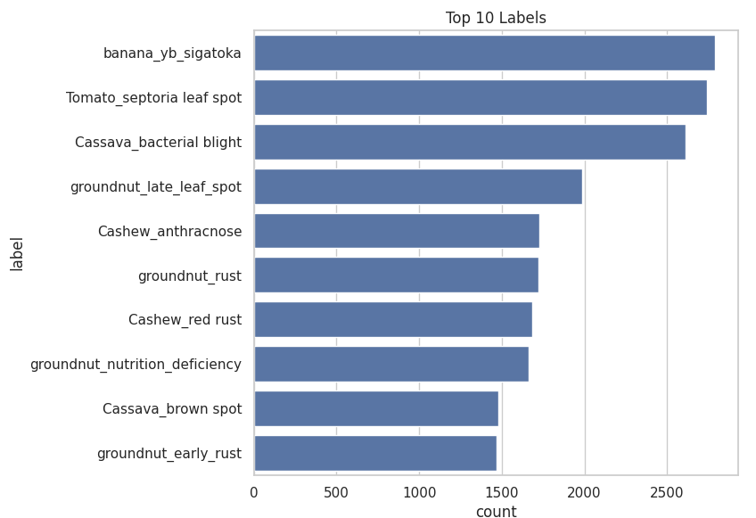
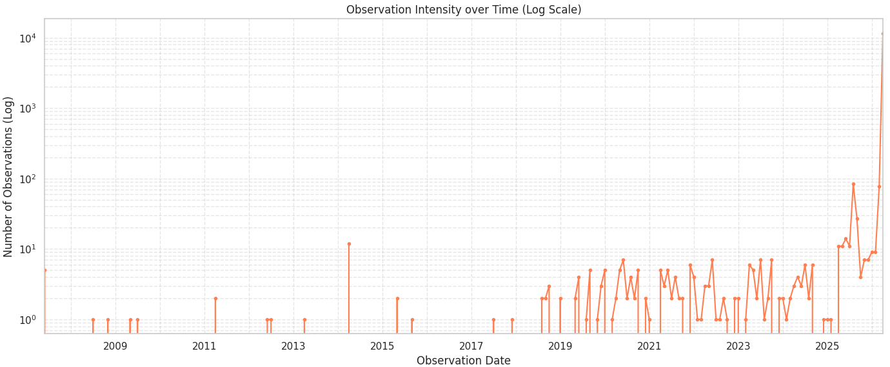
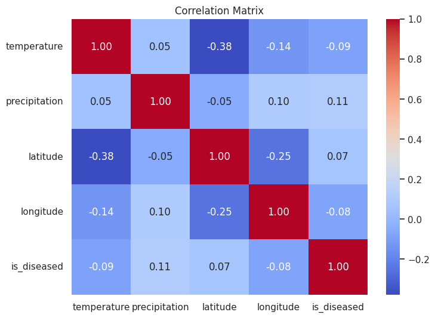

# Exploratory Data Analysis (EDA)

## 1. General Dataset Description
- **Business Context:** Machine learning task for an AgriTech company focused on binary image classification (Healthy vs. Diseased plants) to accelerate disease diagnosis on farms.
- **Data Sources:** A combined dataset sourced from iNaturalist (real-world field photography) and several specialized datasets (CCMT Ghana, MCDD India, PlantSeg).
- **Dataset Size:** 64,120 rows.
- **Key Attributes:** `source`, `external_id`, `image_url` (path/link to the photo), `label` (category), `is_diseased` (target variable), `latitude`, `longitude`, `observation_date`, `extracted_at`, `raw_json`, `provenance` (Field/Laboratory), `season`, `solar_status`, `temperature`, `precipitation`.
- **Data Types:**
  - **Text (string):** `source`, `external_id`, `image_url`, `label`, `provenance`, `season`, `solar_status`, `raw_json`.
  - **Numerical (float):** `latitude`, `longitude`, `temperature`, `precipitation`.
  - **Boolean (bool):** `is_diseased`.
  - **Temporal (datetime):** `observation_date`, `extracted_at`.
- **Feature Roles:**
  - **Identifiers:** `external_id`, `source`.
  - **Features:** `image_url` (primary feature for Computer Vision), environmental/geographical data.
  - **Target Variable:** `is_diseased` (0 = Healthy, 1 = Diseased).

## 2. Loading & Initial Overview
Data was loaded successfully within a Jupyter Notebook environment (`research/eda_observations.ipynb`) from the SQLite database (`observations.db`) using the `pandas` and `sqlite3` libraries. `matplotlib` and `seaborn` were utilized for visualization. The initial overview (`df.head()`, `df.info()`, `df.describe()`) confirmed schema integrity, column types, and foundational statistics.

**Figure 1**: Data Overview showing the schema, column types and statistics of the integrated dataset.

## 3. Data Quality & Completeness
The primary quality issue identified during the analysis is the high sparsity of metadata (geolocation, date, weather).

- **Missing Values:** Approximately 80% of the dataset lacks environmental metadata.
  - `inaturalist`: Metadata is present in 99.91% of records.
  - `local_ccmt_ghana`, `meta_plantseg`, `yolo_mcdd_india`: 100% missing metadata (these datasets contain only images and labels).
- **Target Distribution Imbalance in Metadata:** Healthy plants (0) have metadata in ~73.6% of cases (predominantly iNaturalist records), while diseased plants (1) possess metadata in only ~0.9% of cases.

**Figure 2**: Cross-tabulation showing 100% missing metadata across all local/offline sources compared to near-perfect completeness from the iNaturalist API.

### Critical Label Defect Discovery
During the EDA process, a significant labeling defect was identified via the "Top 10 Labels". It unexpectedly revealed over 2,800 records assigned the label `IMG`. Deep inspection showed these images originated from the `mcdd_india` dataset. The validation and test splits of this dataset used generic filenames (e.g., `IMG-374.jpg`) instead of incorporating the class name into the file string. The pipeline's original regex extractor mistakenly stored "IMG" as the disease category. After uncovering this during EDA architectural fix was imminent. Dedicated `YoloSource` extractor was implemented to retrieve the true labels directly from the YOLO `.txt` annotation sidecar files, successfully classifying them into their correct categories (e.g., `banana_yb_sigatoka`, `groundnut_late_leaf_spot`).

## 4. Univariate Analysis

- **Target Variable:** There are 15,881 (24.77%) Healthy observations and 48,239 (75.23%) Diseased observations.
- **Categorical Features (Top Classes):** Following the YOLO label fix, the most frequent disease classes are `banana_yb_sigatoka`, `Tomato_septoria leaf spot`, `Cassava_bacterial blight`, `groundnut_late_leaf_spot`, and `Cashew_anthracnose`.

**Figure 3**: Top 10 Labels highlighting the dominant disease classes across the integrated dataset.

- **Temporal Features:** Historical data leading up to 2019 is extremely scarce. The period from 2019 to 2025 exhibits a somewhat even distribution, but with notable gaps. Conversely, there is a massive observation spike in recent months due to the bulk ingestion of local static datasets. A logarithmic scale was strictly required to make historical points visible against the recent surge.

**Figure 4**: Observation Intensity over Time (Log Scale) revealing the massive recent influx of static dataset records versus historical API data.

## 5. Bivariate & Multivariate Analysis

- **Correlation Matrix:** 
  - The correlation between the presence of disease (`is_diseased`) and weather conditions is negligible. The maximum correlation observed with the target variable is with `precipitation` at **0.11**.
  - The strongest correlation overall is between `latitude` and `temperature` at **-0.38**, which represents a natural geographical trend rather than an epidemiological one.

**Figure 5**: Correlation heatmap demonstrating the weak relationship between environmental metadata and plant disease.

Boxplots and violin plots comparing temperature/precipitation against disease status confirmed that weather conditions alone do not possess strong predictive power for classification within this dataset context.

## 6. Target Variable Analysis

- **Content:** `is_diseased` is a binary variable (0 = Healthy, 1 = Diseased).
- **Class Imbalance:** The dataset suffers from a significant class imbalance at a ratio of approximately 1:3 (Healthy:Diseased).

**Figure 5**: Target Class Balance demonstrating the 24.77% vs 75.23% skew toward diseased samples.

- **Implications for Modeling:** Because of this imbalance, `Accuracy` will be a misleading evaluation metric (as was mentioned in prevoius documents, though the balance was tipped the other way earlier). The project must evaluate success using **Precision, Recall, F1-score**, and **ROC-AUC**. Recall is specifically prioritized to minimize the business risk of missing a disease. Algorithm training will require balancing strategies such as class weighting (Class Weights), stratified batch sampling, or data augmentation specifically targeting the minority "Healthy" class.

## 7. Analytical Conclusions

**1. Is the dataset suitable for solving the business problem?**
Yes. With over 64,000 distinct observations, the dataset is sufficiently large to train a Computer Vision model (such as a CNN or Vision Transformer) for binary disease detection.

**2. What are the main data quality problems identified?**
- ~80% sparsity in geographic and environmental metadata.
- A 1:3 class imbalance between healthy and diseased samples.
- A critical labeling error (`IMG` labels from generic filenames) that was identified via EDA and subsequently resolved using a custom YOLO annotations extractor.

**3. Which features are potentially most useful for the model?**
Given the negligible correlation between disease and available weather metrics (max 0.11), the only highly informative and universally present feature is the visual data itself (`image_url`) alongside the target variable (`is_diseased`). The bet on temporal and location metadata usage as debiasing context turned out inconsequentual.

**4. What steps should be taken in the next data cleaning/modeling stage?**
- **Feature Selection:** Ignore missing numerical/weather columns during model training, as they lack predictive power and consistency.
- **Stratification:** Apply strict stratified sampling during the `train/val/test` split to preserve the 1:3 class proportion.
- **Balancing:** Configure Class Weights in the loss function or implement selective Data Augmentation to prevent the model from biasing toward the majority "Diseased" class.
- **Image Preprocessing:** Resize, crop, and normalize the raw images to meet the input tensor requirements of the selected neural network architecture.
