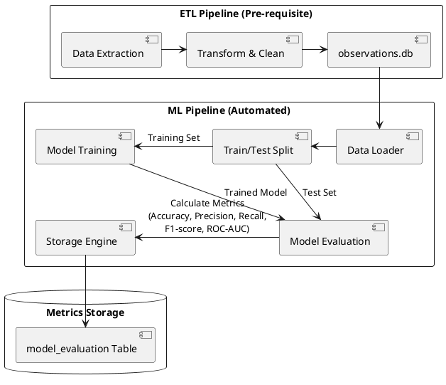
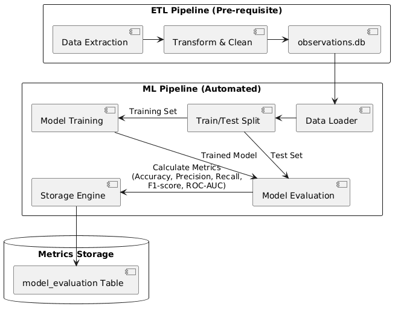

<!-- Step: 13 -->
# Data Pipeline with Automatic Metric Evaluation

## 1. Pipeline Purpose

**Business Task:** The pipeline solves the binary classification problem of identifying whether a plant in an image is "Diseased" or "Healthy". This serves as a rapid initial screening tool to alert farm owners to potential crop issues before expensive agronomist visits are scheduled.
**Inputs:** The pipeline ingests pre-processed data from a SQLite database (`observations.db`), containing URLs or paths to images and relevant metadata (like labels, source, etc.), which has already passed through the ETL quality gates.
**Outputs:** 
- A trained Champion Model capable of inference.
- Detailed evaluation metrics indicating model performance.
- A persistent record of the run parameters and results in the database.
**Evaluation Stage:** Evaluation occurs immediately after model training. The pipeline uses a fixed test set to calculate metrics on unseen data before saving the model state and evaluation results to the database.

## 2. Pipeline Structure

The automated pipeline consists of modular stages that handle data ingestion, splitting, training, evaluation, and storage.

<!--

-->

**Figure 1.** ML Pipeline Structure

## 3. Automated Metric Computation & Data Quality

**Integrated Data Quality Monitoring (Step 13.5):**
The ML pipeline incorporates a subset of the ETL quality audit during the data loading stage. Before training begins, the `get_quality_metrics` function evaluates the sampled dataset for:
- **Completeness:** Verifying critical fields and metadata presence.
- **Uniqueness:** Ensuring no duplicates exist in the specific sample.
- **Balance:** Monitoring the `diseased_ratio` to ensure representative training.
These metrics are logged to the console and persisted in the database alongside model performance, allowing for correlation between data quality and model accuracy.

**Automated Metrics:**
The pipeline automatically computes:
- **Recall:** Primary metric for business cost (minimizing false negatives).
- **F1-Score:** Harmonic mean balancing false alarms and missed diseases.
- **Precision:** Tracks false alarm rate.
- **Accuracy:** General performance.
- **ROC-AUC:** Measures the model's ability to distinguish classes.
- **Confusion Matrix:** Provides absolute counts of True Positives, False Positives, etc.

## 4. Stability Analysis

To ensure results are not statistical flukes, the pipeline employs stability measures:
- Fixed `random_state` during the train/test split.
- Stratified sampling to ensure target class proportions remain consistent across splits.
- Integration of learning rate schedulers (`CosineAnnealingLR`) in the champion model to ensure stable convergence.

## 5. Storage of Results

All evaluation runs are automatically persisted to a new `model_evaluation` table in the existing `observations.db` SQLite database. The table records:
- Timestamp of the run.
- Model name and configuration parameters.
- Execution time.
- Data Quality Score and Class Balance.
- All computed metrics (Accuracy, Precision, Recall, F1, ROC-AUC).

## 6. Business Interpretation

The metrics must be interpreted through the lens of the business:
- **High Recall is Crucial:** A low Recall means the model misses actual diseases (False Negatives). This is the most expensive error, leading to uncontrolled crop damage. The model must prioritize Recall even if it costs a slight drop in Precision.
- **Precision Manages Cost:** While secondary, poor Precision (too many False Positives) means agronomists are dispatched for healthy plants. This erodes trust and wastes money. The F1-Score ensures this doesn't drop to unacceptable levels.
- **Latency Requirement:** The pipeline is a precursor to field deployment. While not a strict classification metric, training and inference speed are logged. Inference must ultimately be ≤ 3.0s per image for a viable user experience.
