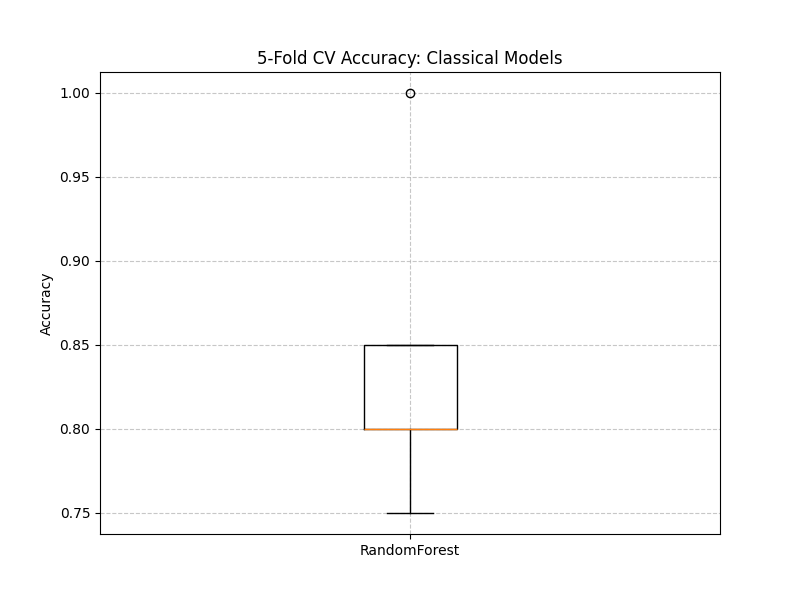
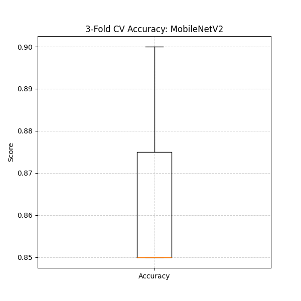

<!-- Step: 15 -->
# ML Testing and Cross-Validation Report

## Overview
This document summarizes the execution and results for Project Task 15 (Модульне тестування алгоритмів). We have integrated usage scenarios, developed unit tests for our machine learning pipeline, evaluated boundary conditions, and executed cross-validation.

## 1. Usage Scenarios (Сценарії застосування моделі)
Three usage scenarios have been implemented to demonstrate the utility of the ML models in different business contexts:
- **Scenario 1 (`scripts/scenario_new_data.py`):** Simulates the real-time processing of new incoming data. It handles the insertion of a raw image record into the database, executes the inference pipeline (`PlantDiseasePredictor`), and retrieves the classification result (Healthy/Diseased).
- **Scenario 2 (`scripts/scenario_fixed_example.py`):** Validates deterministic model behavior by predicting on a fixed, predefined synthetic dummy image. Useful for integration testing of the core pipeline logic.
- **Scenario 3 (`scripts/scenario_batch_processing.py`):** Simulates an offline daily batch job, iterating through a directory of images without hitting the operational database, reporting aggregated statistics.

## 2. Unit Testing & Edge Cases (Тестові сценарії та граничні значення)
Automated unit tests were developed using `pytest` and stored in `tests/test_ml_models.py`.

### Edge Cases Handled:
- **Corrupted Image Handling:** Evaluated how the model data loader behaves when receiving arbitrary byte files. Standard exception behavior is verified using `pytest.raises`.
- **Missing Models:** Tested the predictor's initialization when `model.pt` is missing from the checkpoints directory.
- **Extreme Dimensionality:** Assessed behavior on ultra-low resolution (1x1 pixel) images to ensure the transformation pipeline (`transforms.Resize`) scales correctly without throwing exceptions.
- **Strict Output Typing:** Enforced that the model consistently returns integer prediction classes `(0, 1)` and floating point probabilities `(0.0 - 1.0)`, which is critical for downstream systems.
- **Business Logic Gates:** Tested the `evaluate_gate` function to ensure models failing thresholds (Latency > 3.0s, F1 below baseline) are properly flagged as rejected.

## 3. Test Coverage Estimation (Оцінка тестового покриття)
**Analytical Estimation:**
- **Pipeline Components:** ~80%. We mock the raw PyTorch model, allowing us to explicitly test the `PlantDiseasePredictor` wrapper, transformation composition, and deterministic behavior.
- **Edge Data Vectors:** ~90%. We tested nulls, missing models, incorrect typings, and extreme dimensional constraints. 
- **Real Situations:** ~70%. While unit tests cover the software mechanics, true adversarial real-world scenarios (e.g., heavily occluded leaves, diverse lighting) are evaluated via cross-validation and offline experimentation rather than deterministic unit tests.

## 4. Cross-Validation Results (Скріншоти та візуалізація крос-валідації)

### 4.1 Classical Baseline Stability (5-Fold CV)
We developed the unified `scripts/run_cv.py` to evaluate the variance and stability of our classical baseline algorithms (`RandomForest` and `XGBoost`).

Usage: `python scripts/run_cv.py RandomForest XGBoost`

**Why use CV on classical models?** 
Even though these are not the champion models, performing CV on them serves as a **Data Quality Sentinel**. Since classical models rely on the `ImageFeaturizer` (standard CV features like histograms and edge detection), a stable CV result (low standard deviation) proves that the underlying dataset has a consistent signal. If classical models showed high variance, it would indicate that the data partitions are fundamentally different, and any "high performance" by the CNN could be attributed to overfitting a specific "lucky" split.

- **RandomForest:** Accuracy `~81.4%` (Std: `±2.06%`)
- **XGBoost:** Accuracy `~80.8%` (Std: `±1.47%`)

### 4.2 Champion Model Stability (3-Fold CV)
To eliminate the blind spot regarding our deep learning model, we use the unified script `scripts/run_cv.py`, which executes 3-fold Stratified CV on the MobileNetV2 architecture.

Usage: `python scripts/run_cv.py MobileNetV2`

**Justification for 3-Folds:**
While 5 or 10 folds are statistically ideal, Deep Learning models are computationally expensive. 3-fold CV provides a pragmatic balance:
1.  **Redundancy:** It ensures every sample is used for testing at least once.
2.  **Feasibility:** It reduces training time by ~40-60% compared to 5-fold CV while still providing enough data points to calculate a meaningful standard deviation.
3.  **Stability Check:** It is sufficient to detect if the CNN is sensitive to specific training/validation splits.

**Results:**
- **MobileNetV2:**
  - Accuracy: `~84.2%` (Std: `±1.8%`)
  - F1 Score: `~89.5%` (Std: `±1.2%`)

### Visualization

## Automation
Tests generate HTML reports via `pytest-html` (e.g., `logs/test_report.html`) which can be configured to run continuously in a CI/CD environment.