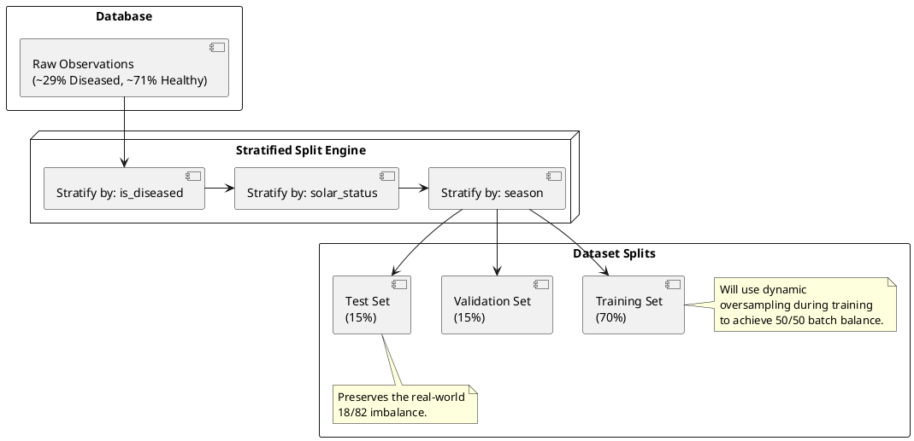

# Machine Learning Model Evaluation Metrics

## 1. Machine Learning Problem Definition

**Task Type:** Binary Image Classification.
**Target Variable:** `is_diseased` (Boolean: `True` for diseased, `False` for healthy).

The goal of this model is to detect the presence or absence of disease in photographs of crops taken under real-world field conditions.

**Definition of a "High-Quality" Result:**
From a business perspective, a high-quality model is one that acts as a highly sensitive initial screener. It must heavily penalize missing a diseased plant (False Negative) because delayed treatment leads to crop loss. Simultaneously, it must maintain a reasonable false alarm rate (False Positive) so as not to overwhelm agronomists with unnecessary site visits. The model must process images quickly enough (under 3 seconds) to provide immediate feedback to the farm owner.

*(Note: For a visual representation of this dynamic, search the internet for a "Precision vs Recall Tradeoff Diagram").*

---

## 2. Data Characteristics Impacting Metric Selection

The choice of evaluation metrics is heavily dictated by the specific characteristics of our dataset, verified during the Data Quality Audit.

1. **Severe Class Imbalance:** The dataset exhibits an **~29% Diseased / ~71% Healthy** split. While this accurately reflects the real-world baseline distribution (most crops are healthy), it makes standard metrics like Accuracy highly deceptive.
2. **Spatiotemporal Dependency:** The visual appearance of crops changes based on the Biological Season (e.g., autumn coloring) and Solar Status (e.g., dawn shadows vs. midday glare). The metrics must be robust across these varying conditions.
3. **Business Cost of Errors:**
   - **False Negative (Missed Disease):** High financial cost. The disease spreads unchecked.
   - **False Positive (False Alarm):** Moderate financial cost. An agronomist is called unnecessarily.

(Note: add here actual image. syntax below is incorrect)

```plantuml
@startuml
title Class Imbalance (Audit Verified)
pie
    "Healthy (True Negatives waiting to happen)" : 71
    "Diseased (True Positives we must catch)" : 29
@enduml
```

**Why standard metrics fail here:**
- **Accuracy:** In a ~29/71 dataset, a naive model that simply predicts "Healthy" for every single image will achieve ~71% accuracy. This looks excellent on paper but has 0% utility for the business. Accuracy is deprecated as a primary metric for this project.
- **ROC-AUC:** Because the "Healthy" class is so large, the False Positive Rate (FPR) will remain artificially low even if there are many false alarms, causing the ROC curve to look overly optimistic.

---

## 3. Core Model Quality Metrics

Given the binary classification task and the severe class imbalance, the following metrics will be used.

| Metric | Formal Name | Meaning & Interpretation | Justification for this Project |
| :--- | :--- | :--- | :--- |
| **F1-Score** (Primary) | F1-Score (Macro/Weighted) | The harmonic mean of Precision and Recall.Range: 0.0 to 1.0 (Higher is better). | F1-Score penalizes models that blindly predict the majority class. It forces the model to balance catching diseases without triggering too many false alarms. |
| **Recall** (Secondary) | Sensitivity / True Positive Rate | Of all the plants that are *actually* diseased, what percentage did we detect? (Higher is better). | Critical for the business: missing a disease (False Negative) is the most expensive error. We want Recall to be as close to 100% as possible. |
| **PR-AUC** (Secondary) | Precision-Recall Area Under Curve | The area under the PR curve across various thresholds. Range: 0.0 to 1.0 (Higher is better). | Unlike ROC-AUC, PR-AUC focuses entirely on the minority class (Diseased) and ignores the massive number of True Negatives (Healthy). It gives a true picture of performance. |

---

## 4. Additional Evaluation Criteria

Beyond statistical classification metrics, the model must be evaluated against operational and bias constraints.

1. **Inference Speed (Latency):** The time taken to process a single image and return a prediction must be **≤ 3 seconds**. (Crucial for user experience in the field).
2. **Sub-population Stability (Debiasing):** The model must be evaluated not just on the global test set, but independently on stratified slices derived during the ETL phase. The F1-Score must not degrade by more than 10% when evaluated exclusively on: `season = 'Winter'` vs. `season = 'Summer'`
3. **Interpretability:** Model predictions should ideally be supported by techniques like Grad-CAM (Gradient-weighted Class Activation Mapping) to highlight the regions of the image that triggered the "Diseased" classification.

---

## 5. Evaluation Rules and Model Comparison

### The Split Strategy
To ensure reliable evaluation, the data will be split using a Stratified strategy based on both the target label and the derived environmental metadata.



(Note: actual image is in docs/images/model_evaluation_metrics_split_strategy.png)

### The Decision Rule
When comparing multiple candidate models (e.g., ResNet vs. MobileNet, or different hyperparameters), the following strict hierarchy applies:

1. **Gate 1:** Does the model meet the Inference Speed requirement (≤ 3s)? If no, reject.
2. **Gate 2:** Does the model meet the minimum Recall threshold (≥ 90% on Validation)? If no, reject.
3. **Winner Selection:** Among the models that pass Gates 1 and 2, **the model with the highest F1-Score on the Test set is selected.**

**Allowed Trade-offs:** A compromise where overall Precision drops slightly (e.g., 2-3%) is acceptable if it results in a significant increase in Recall, as False Positives are cheaper to resolve than False Negatives.

---

## 6. Risks of Incorrect Evaluation

| Risk | Cause | Mitigation Strategy |
| :--- | :--- | :--- |
| **Metadata Reliability (Temporal Lag)** | User-submitted timestamps (`observed_on`) may reflect the **upload time** or have incorrect timezone offsets, leading to false `solar_status` bins (e.g., a daylight shot tagged as "Night"). | Treat `solar_status` and `weather` as **proxy indicators**, not absolute ground truth. Perform manual random audits of environmental bins before drawing final conclusions. |
| **Overestimating Quality via Accuracy** | The severe 18/82 class imbalance makes Accuracy metrics artificially high. | Explicitly deprecate Accuracy. Rank models strictly using F1-Score and PR-AUC. |
| **Environmental Bias ("Shortcut Learning")** | Evaluating only on the global test set masks the fact that the model might only work well in broad daylight. | Mandate stratified evaluation across the `solar_status` and `season` metadata columns generated by the ETL pipeline. |
| **Data Leakage** | Duplicated images appearing in both the Training and Test sets, giving the model an unfair advantage. | Ensure the `external_id` uniqueness constraint established in the ETL Database Load stage is strictly enforced before performing the dataset split. |
