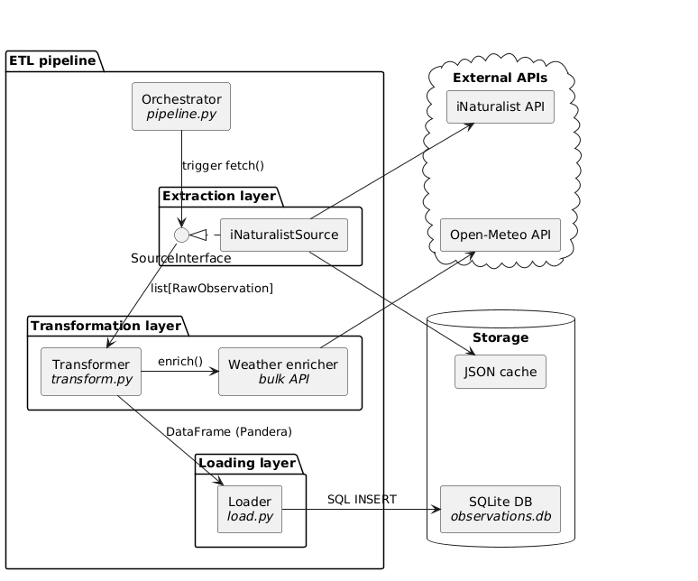

# AgriTech Plant Disease Detection — ETL Module Documentation

## 1. Data Source Selection

### Source: iNaturalist API
- **URL:** https://api.inaturalist.org/v1
- **Relevance:** iNaturalist contains millions of real-world plant observations photographed by ordinary people in field conditions — varying lighting, angles, camera quality, and backgrounds. This closely mirrors the conditions under which a farm owner would photograph crops, making it the most realistic training data source for a binary plant disease classifier compared to controlled lab datasets like PlantVillage.
- **Data Format:** JSON REST API responses containing observation objects with photos, taxonomic labels, annotations, geolocation, and observation date.
- **Access Constraints:**
  - No authentication required for read access
  - Maximum 200 results per page
  - Rate limiting recommended at 1 second between requests
  - Research-grade observations filtered for label quality
  - Update frequency: continuous — new observations added daily

---

## 2. Input Data Structure Analysis

### Key Entities and Attributes

| Field | Description | Type | Example | Role in Analysis |
|---|---|---|---|---|
| `id` | Unique observation identifier | `int` | `12345678` | Primary key |
| `photos[].url` | URL of observation photograph | `str` | `https://...` | Image source for model training |
| `taxon.name` | Scientific plant name | `str` | `Solanum lycopersicum` | Taxonomic label |
| `annotations[].controlled_attribute_id` | Annotation type identifier | `int` | `9` | Disease status verification |
| `annotations[].controlled_value_id` | Annotation value identifier | `int` | `11` | Disease status verification |
| `location` | Comma-separated lat/lon string | `str` | `50.4501,30.5234` | Geographic filtering |
| `observed_on` | Observation date | `str` | `2024-03-15` | Temporal metadata |
| `quality_grade` | Community verification status | `str` | `research` | Data quality filter |

### Potential Data Problems
- **Sparse annotations:** Most iNaturalist observations lack explicit disease annotations. The pipeline now uses a project-based strategy, fetching from verified plant pathology projects to assign the diseased label, replacing the older, faulty `term_id` mapping.
- **Inconsistent coordinates:** `location` field is a raw string requiring parsing; may be absent or malformed.
- **Label noise:** Healthy observations are fetched without disease filter — some may in fact be diseased but unannotated.
- **Class imbalance:** Balanced fetching strategy (alternating diseased/healthy pages) ensures an artificial 1:1 class ratio in the raw dataset.
- **Image quality variance:** Real field photographs vary widely in resolution, focus, and lighting.

### Fields Used in Further Analysis
- `external_id` — deduplication and traceability
- `image_url` — future image download for model training
- `is_diseased` — binary classification target label assigned during extraction
- `label` — taxonomic context
- `observation_date` — temporal filtering and drift analysis
- `latitude`, `longitude` — geographic distribution analysis
- `extracted_at` — metadata for lineage tracking

---

## 3. ETL Module Structure

```
etl/
├── config/
│   └── types.py                  # Pydantic models for configuration validation
├── sources/
│   ├── interface.py              # Abstract base class and RawObservation dataclass
│   └── inaturalist.py            # iNaturalist API source with internal balancing/caching
├── data/
│   ├── raw/
│   │   └── inaturalist/
│   │       ├── diseased/         # Page-level JSON cache (diseased)
│   │       └── healthy/          # Page-level JSON cache (healthy)
│   └── processed/
│       └── observations.db       # Cleaned observations in SQLite
├── logs/                         # ETL execution logs
├── config.toml                   # Pipeline configuration
├── extract.py                    # Extract stage — source registry & execution
├── transform.py                  # Transform stage — pandas cleaning pipeline
├── load.py                       # Load stage — bulk SQLite ingestion
└── pipeline.py                   # Entry point — orchestrates the full ETL
```

---

## 4. Configuration

The pipeline uses `Pydantic` for runtime validation. If `config.toml` is missing required keys or contains invalid types, the pipeline will fail immediately with a descriptive error.

```toml
[general]
download_images = false
log_level = "INFO"
raw_data_path = "data/raw"
processed_data_path = "data/processed"

[sources.inaturalist]
enabled = true
refetch = false
base_url = "https://api.inaturalist.org/v1"
taxon_id = 47126        # Plantae
project_ids = [49595, 124267, 227684, 47428, 255039]
per_page = 200          # API maximum
max_pages = 5
rate_limit_seconds = 5.0

[load]
format = "sqlite"
target_path = "data/processed/observations.db"
table_name = "observations"
```

---

## 5. Module Descriptions

### `config/types.py` — Configuration Models
Defines `Pydantic` models (`AppConfig`, `GeneralConfig`, etc.) for strict runtime validation. Uses `HttpUrl` for URL validation and `Literal` for constrained string fields (e.g., `log_level`).

### `sources/interface.py` — Data Contract
Defines the `RawObservation` dataclass — the universal format for all extracted data.
- **Self-contained:** Includes `is_diseased` label assigned at the source.
- **Serialization:** Includes `to_dict()` and `from_dict()` for cache interoperability.

### `sources/inaturalist.py` — iNaturalist Source
Implements source-specific logic including:
- **Balanced Fetching:** Alternates between diseased and healthy API queries to maintain synthetic 1:1 class ratio.
- **Internal Caching:** Manages its own directory-based JSON cache to avoid redundant network calls.
- **Robust Parsing:** Converts raw API JSON directly into `RawObservation` objects.

### `extract.py` — Extract Registry
Acts as a source factory. It loads the validated configuration, identifies all enabled sources, and executes their `fetch()` methods. It returns a unified `list[RawObservation]` to the pipeline.

### `transform.py` — Transform Pipeline
Operates on a `list[RawObservation]` and produces a cleaned `pd.DataFrame`.
1. **Deduplication:** Removes records with duplicate `(source, external_id)`.
2. **Date Parsing:** Standardizes `observation_date` and `extracted_at` to timezone-naive UTC.
3. **Metadata Enrichment:** Derives exact context from spatio-temporal metadata to prevent spurious correlations:
    - **Solar Status:** Uses precise astronomical calculations (`astral`) to categorize sun position as "Daylight", "Dusk/Dawn", "Night", or "Polar".
    - **Seasonal Context:** Maps `latitude` and `date` to biological seasons (Spring/Summer/Autumn/Winter).
    - **Weather:** Fetches historical `temperature` and `precipitation` data via the Open-Meteo API.
4. **Type Casting:** Ensures correct numeric and boolean types.
5. **Coordinate Filtering:** Removes rows with invalid latitude/longitude ranges.
6. **Schema Validation:** Uses `Pandera` to enforce structural integrity before passing data to the Load stage.

### `load.py` — Load Stage
Uses an optimized bulk-loading strategy:
1. **Temp Table:** Dumps the DataFrame into a temporary SQLite table.
2. **Bulk Insert:** Executes `INSERT OR IGNORE INTO observations SELECT ... FROM temp_table` to handle idempotency efficiently.
3. **Verification:** Logs the number of new records vs. duplicates and reports the final database count.

### `pipeline.py` — Orchestrator
The main entry point. It manages the high-level state:
- Initializes logging.
- Loads and validates configuration via Pydantic.
- Passes the validated `AppConfig` down to sub-modules.
- Coordinates the handover: `extract -> transform -> load`.

---

## 6. ETL Process Schema

<!--
```plantuml
@startuml
skinparam componentStyle rectangle
skinparam defaultTextAlignment center

skinparam package<<hidden>> {
  BackgroundColor transparent
  BorderColor transparent
  FontColor transparent
}
skinparam component<<hidden>> {
  BackgroundColor transparent
  BorderColor transparent
  FontColor transparent
}

' ── diagram ──────────────────────────────────────────────
package "ETL pipeline" {
  component [Orchestrator\n//pipeline.py//] as orch

  package "Extraction layer" {
    interface "SourceInterface" as iface
    component [iNaturalistSource] as inat
    inat .right.|> iface
  }

  package "Transformation layer" {
    component [Transformer\n//transform.py//] as trans
    component [Weather enricher\n//bulk API//] as weather
  }

  package "Loading layer" {
    component [Loader\n//load.py//] as loader
  }
}

package " " <<hidden>> {
  cloud "External APIs" {
    component [iNaturalist API] as inat_api
    component [Open-Meteo API] as weather_api
  }
  component " " as vspacer <<hidden>>
  database "Storage" {
    component [JSON cache] as cache
    component [SQLite DB\n//observations.db//] as db
  }
}

' ── real arrows ──────────────────────────────────────────
orch -down-> iface : trigger fetch()
iface -down-> trans : list[RawObservation]
trans -right-> weather : enrich()
trans -down-> loader : DataFrame (Pandera)
loader -left-> db : SQL INSERT
inat -left-> inat_api
inat -down-> cache
weather -up-> weather_api

' ── layout hints (invisible) ─────────────────────────────
inat_api -[hidden]down-> vspacer
vspacer  -[hidden]down-> cache
cache    -[hidden]down-> db
inat_api -[hidden]down-> weather_api
@enduml```
-->




Figure 1: ETL Process Schema

---

## 7. Raw vs Cleaned Data Examples

### Raw Page Cache (`data/raw/inaturalist/diseased/proj_49595_page_1.json`):
JSON-serialized list of `RawObservation` objects.

### Cleaned observation (SQLite row from `data/processed/observations.db`):

| id | source | external_id | image_url | label | is_diseased | latitude | longitude | observation_date | extracted_at | loaded_at |
|---|---|---|---|---|---|---|---|---|---|---|
| 1 | inaturalist | 12345678 | https://... | Solanum lycopersicum | 1 | 50.4501 | 30.5234 | 2024-03-15 | 2026-04-10T13:14:38 | 2026-04-10T13:16:32 |

---

## 8. Error Handling

| Error Type | Handling Strategy |
|---|---|
| Invalid Configuration | Pydantic raises `ValidationError` at startup; pipeline exits. |
| API Failure | Log error, return partial results from cache if available. |
| Schema Violation | Pandera raises `SchemaError` during Transformation; pipeline stops. |
| DB Constraint | `INSERT OR IGNORE` silently skips duplicates; reported in final count. |
| Timezone Mismatch | Transform stage localizes all timestamps to naive UTC to satisfy validation. |

---

## 9. Conclusion
The refactored ETL pipeline provides a robust, type-safe, and highly efficient foundation for data collection. By moving to a decentralized source architecture and utilizing `Pydantic` and `Pandera` for multi-layered validation, the system ensures that only high-quality, balanced data reaches the final training set. The bulk loading optimization significantly improves performance for large-scale data ingestion.
