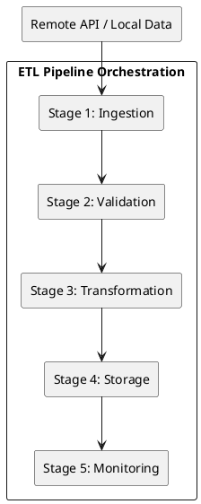
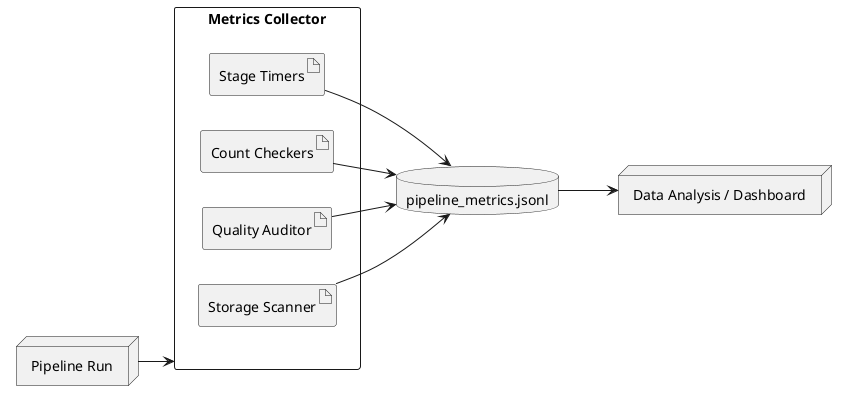

# Step: 11 — Pipeline Automation and Monitoring Report

## 1. Requirement Analysis & Planning

### 1.1 Objective
To transform the existing manual ETL process into an automated, monitored, and resilient pipeline. Given that the iNaturalist API is the primary volatile data source, the focus is on a scheduled checking mechanism to ensure local data remains synchronized.

### 1.2 General Requirements
| Requirement | Description |
|---|---|
| **Data Sources** | iNaturalist API (Remote), Local Datasets (YOLO, Local Metadata) |
| **Update Frequency** | Configurable interval (Default: 60 minutes) |
| **Output Formats** | SQLite (`observations.db`), Monitoring Logs (`pipeline_metrics.jsonl`) |
| **Processing Type** | Batch processing with idempotency (using DELETE-then-INSERT pattern) |
| **Environment** | Local system with Python 3.12 |

---

## 2. Pipeline Structure

The pipeline is structured into five distinct stages to ensure modularity and ease of monitoring.

### Stage Descriptions:
1.  **Ingestion (Extract)**: Fetches raw data from enabled sources.
2.  **Validation**: Ensures the extracted data matches the expected `RawObservation` structure.
3.  **Transformation**: Normalizes data, handles duplicates, enriches with weather/solar metadata.
4.  **Storage (Load)**: Idempotently saves processed observations to the SQLite database.
5.  **Monitoring**: Captures performance metrics, quality scores, and storage usage.

---

## 3. Automation and Resilience Implementation

### 3.1 Strategy: Scheduler
As the main source of data is the iNaturalist API, the **Scheduler** pattern was implemented to fetch new data after a fixed time interval.

### 3.2 Resilience: Checkpointing System
To ensure the pipeline can recover from unexpected failures (network issues, API limits, system crashes) without losing hours of extraction work, a **Checkpointing System** was implemented.

- **Checkpoint Manager**: Manages serialization of intermediate states (Raw Observations, DataFrames, Quality Results) to disk using `pickle`.
- **Resume Capability**: When the `--resume` flag is used, the pipeline skips successfully completed stages and restores data from the last valid checkpoint.
- **Dynamic Optimization**: During a resume run, expensive operations like `refetch` for API sources are automatically disabled to prioritize completion.

### 3.3 Efficiency: Multi-Layer Caching
To optimize performance and minimize API overhead, the pipeline employs a multi-layer caching strategy:
1.  **Stage Checkpoints**: Persistent serialization of stage outputs.
2.  **Weather Cache**: A dedicated SQLite database (`weather_cache.db`) stores location-date pairs with a spatial precision of ~1.1km (rounding to 2 decimal places), enabling massive reuse of environmental data across different observations.
3.  **HTTP Cache**: `requests_cache` provides low-level caching for raw API responses from iNaturalist and Open-Meteo.

---

## 4. Monitoring System
Every mature pipeline requires visibility into its performance and health. The bigger the pipeline gets, the more prominent a need to understand what is happening inside becomes to catch errors and irregularities.

### 4.1 Monitoring Architecture
The monitoring system is integrated directly into the pipeline orchestration layer, ensuring that every run is audited and recorded.

### 4.2 Key Metrics
The following metrics are recorded in `etl/logs/pipeline_metrics.jsonl` for every run:
- **Temporal**: `timestamp`, `total_duration_sec`, and breakdown per stage (Extract, Transform, Quality, Load).
- **Volume**: `extracted`, `transformed`, and `loaded` row counts.
- **Provenance**: List of `sources` processed in the run.
- **Quality**: Full breakdown of the Integral Quality Score (Q) components (q1_completeness, q2_uniqueness, q3_metadata, q4_balance).
- **Storage**: Disk usage of the SQLite database (`db_size_mb`) and image directories (`raw_images_mb`, `processed_images_mb`).

### 4.2 Logging Architecture
- **Operational Logs**: `etl/logs/pipeline.log` (Detailed trace via `setup_logging`).
- **Metric Stream**: `etl/logs/pipeline_metrics.jsonl` (Structured JSON for performance analysis).

---

## 5. Performance Testing (Benchmark)

### 5.1 Test Results
Here the initial results of the benchmarking routine are shown. They WILL differ in the future as pipeline gets bigger or more optimized.

| Batch Size | Transform (s) | Load (s) | Total (s) | Throughput (rec/s) |
|---|---|---|---|---|
| 100 | 1.3316 | 0.0114 | 1.3430 | 74.46 |
| 500 | 0.5734 | 0.0555 | 0.6289 | 795.10 |
| 1000 | 0.6903 | 0.0774 | 0.7676 | 1302.73 |
| 5000 | 1.0570 | 0.1026 | 1.1596 | 4311.81 |

### 5.2 Observations
- **Efficiency**: The pipeline exhibits excellent scalability, with throughput increasing significantly as batch size grows (amortizing setup costs).
- **Storage Stability**: The DELETE-then-INSERT pattern ensures the database does not grow indefinitely with duplicate records.
- **Bottleneck**: The primary bottleneck remains external API latency during the Extraction stage (not shown in local benchmark).
