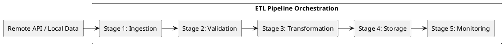
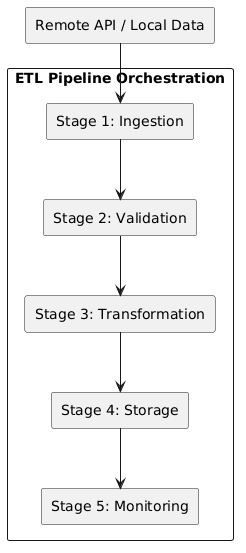
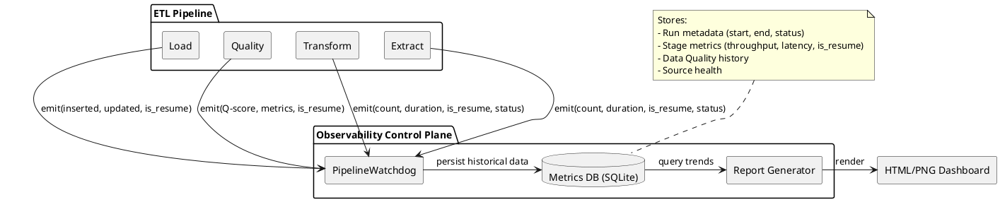
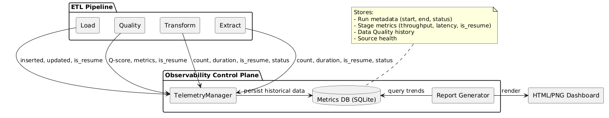

<!-- Step: 11 -->
# Pipeline Automation and Monitoring Report

## 1. Requirement Analysis & Planning

### 1.1 Objective
To transform the existing manual ETL process into an automated, monitored, and resilient pipeline. Given that the iNaturalist API is the primary volatile data source, the focus is on a scheduled checking mechanism to ensure local data remains synchronized.

### 1.2 General Requirements
| Requirement | Description |
|---|---|
| **Data Sources** | iNaturalist API (Remote), Local Datasets (YOLO, Local Metadata) |
| **Update Frequency** | Configurable interval (Default: 60 minutes) |
| **Output Formats** | SQLite (`observations.db`), Monitoring Logs (`pipeline_metrics.jsonl`) |
| **Processing Type** | Batch processing with idempotency (using DELETE-then-INSERT pattern) |
| **Environment** | Local system with Python 3.12 |

---

## 2. Pipeline Structure

The pipeline is structured into five distinct stages to ensure modularity and ease of monitoring.

<!--

-->

### Stage Descriptions:
1.  **Ingestion (Extract)**: Fetches raw data from enabled sources.
2.  **Validation**: Ensures the extracted data matches the expected `RawObservation` structure.
3.  **Transformation**: Normalizes data, handles duplicates, enriches with weather/solar metadata.
4.  **Storage (Load)**: Idempotently saves processed observations to the SQLite database.
5.  **Monitoring**: Captures performance metrics, quality scores, and storage usage.

---

## 3. Automation and Resilience Implementation

### 3.1 Strategy: Scheduler
As the main source of data is the iNaturalist API, the **Scheduler** pattern was implemented to fetch new data after a fixed time interval.

### 3.2 Resilience: Checkpointing System
To ensure the pipeline can recover from unexpected failures (network issues, API limits, system crashes) without losing hours of extraction work, a **Checkpointing System** was implemented.

- **Checkpoint Manager**: Manages serialization of intermediate states (Raw Observations, DataFrames, Quality Results) to disk using `pickle`.
- **Resume Capability**: When the `--resume` flag is used, the pipeline skips successfully completed stages and restores data from the last valid checkpoint.
- **Intelligent Resume Logic**: The `TelemetryManager` identifies completed stages by searching for the most recent run with successful metrics. This ensures that if a resume attempt crashes before completing any new stages, subsequent attempts can still recover from the original point of failure.
- **Dynamic Optimization**: During a resume run, expensive operations like `refetch` for API sources are automatically disabled to prioritize completion.

### 3.3 Efficiency: Multi-Layer Caching
To optimize performance and minimize API overhead, the pipeline employs a multi-layer caching strategy:
1.  **Stage Checkpoints**: Persistent serialization of stage outputs.
2.  **Weather Cache**: A dedicated SQLite database (`weather_cache.db`) stores location-date pairs with a spatial precision of ~1.1km (rounding to 2 decimal places), enabling massive reuse of environmental data across different observations.
3.  **HTTP Cache**: `requests_cache` provides low-level caching for raw API responses from iNaturalist and Open-Meteo.

---

## 4. Monitoring & Observability System
Every mature pipeline requires visibility into its performance and health. As the project simulates an industrial AgriTech firm, the monitoring system has been upgraded to a full **Observability Control Plane** that tracks not just individual runs, but historical trends in data quality and pipeline efficiency.

### 4.1 Observability Architecture
The observability engine is decoupled from the main execution logic via a **Watchdog** pattern. It persists data to a relational metrics store, enabling long-term trend analysis.

<!--

-->

### 4.2 Data Persistence Layers
To ensure the pipeline can recover from unexpected failures (network issues, API limits, system crashes) without losing hours of extraction work, a **Telemetry Manager** is implemented. Its main feature is a SQLite database that consists of 3 tables:
1.  **Runs Table**: Global status and total duration of every execution.
2.  **Stage Metrics Table**: Granular performance data (item counts, latency, and `is_resume` flag) for every stage.
3.  **Quality History Table**: Temporal snapshots of the Integral Quality Score (Q) and its sub-metrics.

### 4.3 Automated Reporting
To visualize results of the pipeline runs, the `scripts/observability_report.py` tool generates images in `observability/`:
- **Quality Trends**: Tracks if the dataset health is improving or degrading over time.
- **Performance**: Show the latency of each stage and the overall pipeline throughput.
- **Dataset Growth**: Monitors the volume of data extracted and loaded.
- **Class Balance Stability**: Tracks the diseased-to-healthy ratio, which is critical for model training stability.

### 4.4 Logging Architecture
- **Operational Logs**: `logs/etl.log` (Detailed trace via `setup_logging`).
- **Control Plane**: `data/processed/metrics.db` (Queryable historical metrics).

---

## 5. Performance Benchmarking

Here the initial results of the benchmarking routine are shown. They WILL differ in the future as pipeline gets bigger or more optimized.

| Batch Size | Transform (s) | Load (s) | Total (s) | Throughput (rec/s) |
|---|---|---|---|---|
| 100 | 1.3316 | 0.0114 | 1.3430 | 74.46 |
| 500 | 0.5734 | 0.0555 | 0.6289 | 795.10 |
| 1000 | 0.6903 | 0.0774 | 0.7676 | 1302.73 |
| 5000 | 1.0570 | 0.1026 | 1.1596 | 4311.81 |

The extract stage is excluded from the bechmark as its hard to accurately measure with unpredictable behaviour of network. In the future this stage might be implemented as part of the bechmark.

