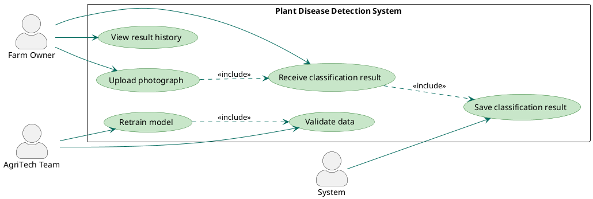
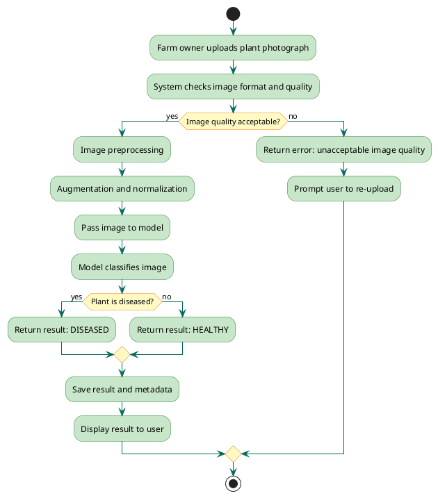

# AgriTech Plant Disease Detection — Requirements Analysis

## 1. Business Problem Formalization

### 1.1 Problem Description — 5W Method

- **Who:** Farm owners operating at a scale where crop disease has significant financial impact, without dedicated in-house expertise to monitor crop health continuously
- **What:** Crop diseases go undetected until visible damage has already spread across significant areas, at which point the cost of intervention and crop loss is substantially higher
- **When:** Throughout the active growing season, particularly during conditions favorable to disease spread such as high humidity or temperature fluctuations
- **Where:** On cultivated farmland where continuous expert monitoring is economically impractical
- **Why:** Early detection currently requires either costly agronomist consultations or labor-intensive manual inspection, making routine systematic monitoring financially unviable for most farm owners

---

### 1.2 Problem Statement

**Ideal Situation:**
Farm owners have access to a fast, affordable and reliable tool that continuously detects plant diseases at an early stage, enabling timely response before the disease spreads to neighboring crops.

**Current Reality:**
Early disease detection requires either regular agronomist visits or constant manual field inspection. Both approaches are expensive, slow and practically impossible to scale across large areas. As a result, diseases are often identified only when damage has already become visible and widespread.

**Consequences and Dependencies:**
- Detection delays directly increase crop losses and remediation costs
- Intervention costs grow proportionally to the affected area
- The financial justification for intervention depends on whether potential yield losses exceed the cost of action — without early detection this threshold is often reached too late
- Dependency on experts creates a bottleneck that does not scale with farm size

**Proposal:**
Develop a binary classification model based on plant photographs that automatically determines the presence or absence of disease. This replaces the initial monitoring stage, reduces detection costs, and compresses response time — leaving treatment decisions to domain experts.

---

### 1.3 Expected Result and Project Scope

**Expected Result:**
A trained, evaluated and documented binary classification model capable of detecting the presence or absence of disease in plant photographs, together with a complete data pipeline from collection to inference.

**In Scope:**
- Data scraping and collection from public internet sources
- Data verification and quality assessment
- Data pipeline development for preprocessing and augmentation
- Development and training of a binary classification model
- Model evaluation and iterative improvement
- Model documentation and evaluation report
- API development as a stretch goal

**Out of Scope:**
- Classification of specific disease types (multiclass classification)
- Deployment in a real production environment
- User interface development
- Integration with existing farm management systems
- Collection of proprietary field photographs

---

## 2. Requirements Type Classification

| Requirements Type | Level | Question | Example |
|---|---|---|---|
| Business Requirements (BRD) | Organization | What does the business want to achieve? | Reduce the cost of crop disease monitoring |
| Business Requirements (BRD) | Product | What value should the product create? | Provide a scalable disease detection tool as a commercial product |
| Business Requirements (BRD) | Process | How should the workflow change? | Reduce disease response time from days to seconds |
| User Requirements | Interaction | What must the user be able to do? | Upload a plant photograph and receive a classification result |
| User Requirements | Experience | How should the user perceive the system? | Use the system without any technical expertise |
| User Requirements | Outcome | What should the user receive as output? | Receive a result fast enough to make an operational decision |
| System Requirements | Functionality | What must the system do? | Classify images with at least 90% accuracy |
| System Requirements | Performance | How fast must the system respond? | Return a classification result within 3 seconds |
| System Requirements | Compatibility | What must the system work with? | Process images in various formats and resolutions |

---

## 3. Requirements Elicitation

### 3.1 Stakeholders

- Farm owners — end users of the product
- AgriTech firm management — internal project sponsor
- Agronomists and domain experts — consulted for data validation and domain knowledge
- Data providers — owners of public datasets and educational resources

### 3.2 Collection Methods

| Method | Stakeholder | Rationale |
|---|---|---|
| Interviews | Farm owners | Identify real pain points and product expectations |
| Questionnaires | Farm owners | Collect quantitative data on problem scale and willingness to use |
| Documentation analysis | Data providers | Review dataset terms of use and structure |
| Observations | Farm owners | Understand real-world crop monitoring workflow |
| Workshops | AgriTech management | Align business goals and project priorities |
| Use case scenarios | Agronomists | Define edge cases and accuracy requirements |

### 3.3 Initial Requirements List

- The system must classify plant photographs as healthy or diseased
- Classification accuracy must be at least 90%
- The system must return a result within 3 seconds
- Data must be collected from public sources and verified before use
- The model must be robust to variations in image quality
- The system must be documented and reproducible

---

## 4. Requirements Analysis and Decomposition

### 4.1 Use Case Diagram

---

### 4.2 UML Activity Diagram

---

### 4.3 Requirements Decomposition

**Requirement 1: The system must classify plant photographs as healthy or diseased**
- The system must accept images in JPG and PNG formats
- The system must verify image quality before classification
- The system must return a binary result — healthy or diseased
- The system must return the model confidence level alongside the result

**Requirement 2: Classification accuracy must be at least 90%**
- The model must achieve precision of at least 90% on the test set
- The model must achieve recall of at least 90% on the test set
- The model must be evaluated on a balanced test set
- Evaluation results must be documented in the final report

**Requirement 3: The system must return a result within 3 seconds**
- Image preprocessing must take no more than 1 second
- Model inference must take no more than 2 seconds
- Result storage must not affect response time

**Requirement 4: Data must be collected from public sources and verified**
- Data must be collected from at least two independent sources
- Each image must have a binary label — healthy or diseased
- Images of unacceptable quality must be filtered before training
- Class balance must be checked and corrected as needed

**Requirement 5: The model must be robust to variations in image quality**
- The model must correctly classify images of varying resolution
- The model must be trained on augmented data with brightness and contrast variations
- The model must return an error for images of unacceptable quality

---

### 4.4 MoSCoW Prioritization

| Priority | Requirement | Rationale |
|---|---|---|
| Must Have | Binary classification of plant photographs | Core product function without which it has no purpose |
| Must Have | Accuracy of at least 90% | Defined as the minimum project success criterion |
| Must Have | Data verification and class balancing | Without this model accuracy cannot be guaranteed |
| Must Have | Complete data processing pipeline | Required condition for result reproducibility |
| Should Have | Result returned within 3 seconds | Important for practical use but does not block core functionality |
| Should Have | Classification result storage | Required for monitoring model performance over time |
| Should Have | Model confidence level in result | Increases result trustworthiness but is not critical |
| Could Have | Result history viewing | Useful feature but outside the core deliverable |
| Could Have | Automatic model retraining | Improves long-term performance but outside 16-week scope |
| Won't Have | Classification of specific disease types | Deliberately excluded from project scope |
| Won't Have | Production environment deployment | Outside the scope of the university project |
| Won't Have | User interface development | Not part of the deliverable |

---

### 4.5 Identifying Contradictions

**Contradiction 1: Accuracy vs. Speed**
The requirement for at least 90% accuracy may require a more complex model architecture, increasing inference time and conflicting with the 3-second response requirement.
Resolution: Optimize the model through quantization or select lighter architectures with acceptable accuracy.

**Contradiction 2: Robustness to Image Quality vs. Accuracy**
The requirement for robustness to low-quality images conflicts with the 90% accuracy requirement — poor images objectively reduce classification accuracy.
Resolution: Introduce an image quality threshold — images below the threshold are rejected with an error rather than classified.

**Contradiction 3: Class Balance vs. Real Data Distribution**
The requirement for a balanced test set conflicts with the real data distribution where diseased plants may be significantly more or less common than healthy ones in public datasets.
Resolution: Apply oversampling or undersampling during data preparation, preserving the real distribution only in the test set for objective evaluation.

---

## 5. Requirements Documentation

### 5.1 Functional Requirements

**Core Functions:**
- The system accepts a plant photograph and returns a binary classification result
- The system verifies image quality before classification
- The system saves classification results for performance monitoring
- The system provides the model confidence level alongside the result

**If/Then Logic:**

| Condition (If) | Result (Then) |
|---|---|
| User uploads an image of acceptable quality | System classifies it as healthy or diseased |
| Image quality is unacceptable | System returns an error and prompts re-upload |
| Model classifies plant as diseased | System returns result: DISEASED with confidence level |
| Model classifies plant as healthy | System returns result: HEALTHY with confidence level |
| Classification is successful | System saves result and metadata |
| Model confidence level is below 70% | System flags result as unreliable and recommends expert review |

---

### 5.2 Non-Functional Requirements

| Category | Requirement | Metric |
|---|---|---|
| Performance | System response time | ≤ 3 seconds per image |
| Performance | Classification accuracy | ≥ 90% F1-score on test set |
| Reliability | False negative rate | ≤ 5% — critical for timely disease detection |
| Reliability | Result reproducibility | Same image must return same result in 100% of cases |
| Scalability | Supported image formats | JPG, PNG, WEBP |
| Scalability | Supported resolution range | 224x224 to 4096x4096 pixels |
| Security | User data protection | Geolocation and personal data not stored without explicit consent |
| Usability | New user onboarding time | User must be able to obtain first result without instructions |

---

### 5.3 Domain-Specific Requirements

**Industry Standards:**
- Plant disease classification must follow EPPO nomenclature — European and Mediterranean Plant Protection Organization
- Model documentation must comply with FAIR principles — Findable, Accessible, Interoperable, Reusable — to ensure scientific reproducibility
- Development and documentation process must comply with ISO 9001 quality management standards

**Regulatory Constraints:**
- The system must comply with GDPR requirements regarding personal data storage — geolocation and farmer identification data are not collected without explicit consent
- Under EU AI Act 2024 the system falls under the limited risk category — users must be informed they are interacting with an artificial intelligence system
- Classification results must be accompanied by a disclaimer that they do not replace expert agronomic consultation

---

### 5.4 Data Requirements

**Sources:**
- Public datasets — PlantVillage and other open plant disease image collections
- Educational resources collected via web scraping in compliance with terms of use

**Formats:**
- Images in JPG and PNG formats
- Labels in CSV or JSON format with binary value — healthy or diseased

**Structure:**
- Each record must contain: image identifier, file path, binary label, data source
- Data split into training, validation and test sets in a 70/15/15 ratio

**Data Management Policies:**
- All collected data must be used exclusively within the scope of the project
- The source of each image must be documented to ensure traceability
- Images of unacceptable quality are removed and documented separately
- Class balance is verified after each data collection stage

---

## 6. Requirements Quality Check

| Criterion | Definition | Verification Question |
|---|---|---|
| Unambiguous | Requirement has only one interpretation | Can different team members interpret it differently? |
| Complete | Requirement contains all necessary information | Is there enough information to implement it without further clarification? |
| Agreed | Requirement does not conflict with other requirements | Does it conflict with requirements identified in section 4.5? |
| Verifiable | Requirement fulfillment can be tested | Is there a specific metric or test to confirm it? |
| Traceable | Requirement is linked to a business goal | Can its origin be traced? |
| Design-agnostic | Requirement does not impose a technical solution | Does it describe what to do rather than how? |

**Example of improving an ambiguous requirement:**

| | Formulation |
|---|---|
| ❌ Poor | The system must classify images quickly |
| ✅ Good | The system must return a classification result within 3 seconds of receiving an image of acceptable quality |

The poor requirement violates the unambiguity and verifiability criteria — "quickly" has no concrete meaning and cannot be tested. The good requirement resolves both issues.

---

## 7. KPIs and Acceptance Criteria

### 7.1 Project Success Metrics

| Metric | Definition |
|---|---|
| F1-score | Balanced measure of classification precision and recall |
| Precision | Share of correctly identified diseased plants among all identified as diseased |
| Recall | Share of correctly identified diseased plants among all actually diseased |
| Inference time | Time from receiving the image to returning the result |
| Data quality | Share of images passing verification out of total collected |
| Class balance | Ratio of healthy to diseased images in the training set |

---

### 7.2 Targets

| KPI | Target | Rationale |
|---|---|---|
| F1-score | ≥ 90% | Defined as minimum success criterion in SMART objectives |
| Precision | ≥ 90% | Minimizes false positive results |
| Recall | ≥ 90% | Critical for disease detection — false negatives are most harmful |
| Inference time | ≤ 3 seconds | Ensures practical product viability |
| Data quality | ≥ 80% of images pass verification | Minimum threshold for reliable training |
| Class balance | No more than 20% deviation between classes | Prevents model bias toward one class |

---

### 7.3 Acceptance Criteria

| Criterion | Acceptance Condition |
|---|---|
| Model | F1-score ≥ 90% on an independent test set |
| Performance | Inference time ≤ 3 seconds for standard resolution images |
| Data | Pipeline processes JPG and PNG images with automatic quality verification |
| Reliability | Recall ≥ 90% — system does not miss more than 10% of diseased plants |
| Documentation | Model documented with a model card including metrics, limitations and usage conditions |
| Reproducibility | Full pipeline from data collection to inference reproducible from instructions without additional clarification |
